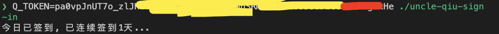

<h1 align="center">
   
  丘大叔签到脚本
   
</h1>

  
](https://github.com/ClassmateLin/uncle-qiu-sign-in/releases)
  
](https://github.com/ClassmateLin/uncle-qiu-sign-in/releases)

## 下载

点击[releases](https://github.com/ClassmateLin/uncle-qiu-sign-in/releases)可下载对应平台的二进制文件。

## 编译

**请确认你已安装好Rust.**

- 拉取代码: `git clone https://github.com/ClassmateLin/uncle-qiu-sign-in.git && cd uncle-qiu-sign-in`

- 编译: `cargo build --release`, 输出的二进制文件的路径 `./target/release/uncle-qiu-sign-in`。

## 使用

打开微信小程序《丘大叔柠檬茶》, 抓包获取请求头中的`Qm-User-Token`。

执行脚本:`Q_TOKEN=paxxxT7o_xxxxxxxxxxxHe ./uncle-qiu-sign-in`。

